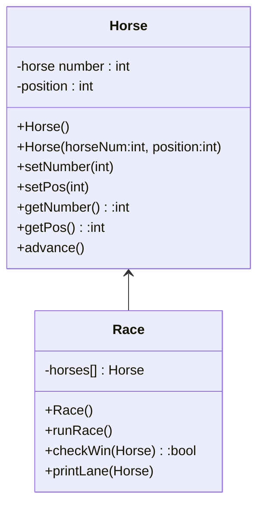

# cs121-project-5



## Horse class functions
```
advance(){
    create random device
    set random device to choose 1 or 0
    
    coin variable = random device
    if coin = 1:
        increase horse position by 1
}
```

## Race class functions
```
checkWin(horse){
    gets the input horse's position
    if horse position = 15:
        print "horse number 'x' has won!" (x is the horse's number)
        return false to keepGoing
    else:
        return true to keepGoing
}

printLane(horse){
    get horse number
    get horse position
    create lane string of "..............."
    set the period in the horse's position to the horse's number
}

runRace(){
    set horses array to 5 horses with increasing numbers, all starting on position 0
    set keepGoing boolean variable to true

    while keepGoing is true:
        for i = 0 to i < 5:
            advance horse in lane i
            if keepGoing is true:
                check if current horse wins using checkWin()
                set keepGoing according to result of checkWin()
        print "press ENTER to continue"
        wait for user input
        ignore anything written in the input
}
```

## main function algorithm
```
include horse header
include race header

create race object mainEvent
run mainEvent's runRace() method
```
